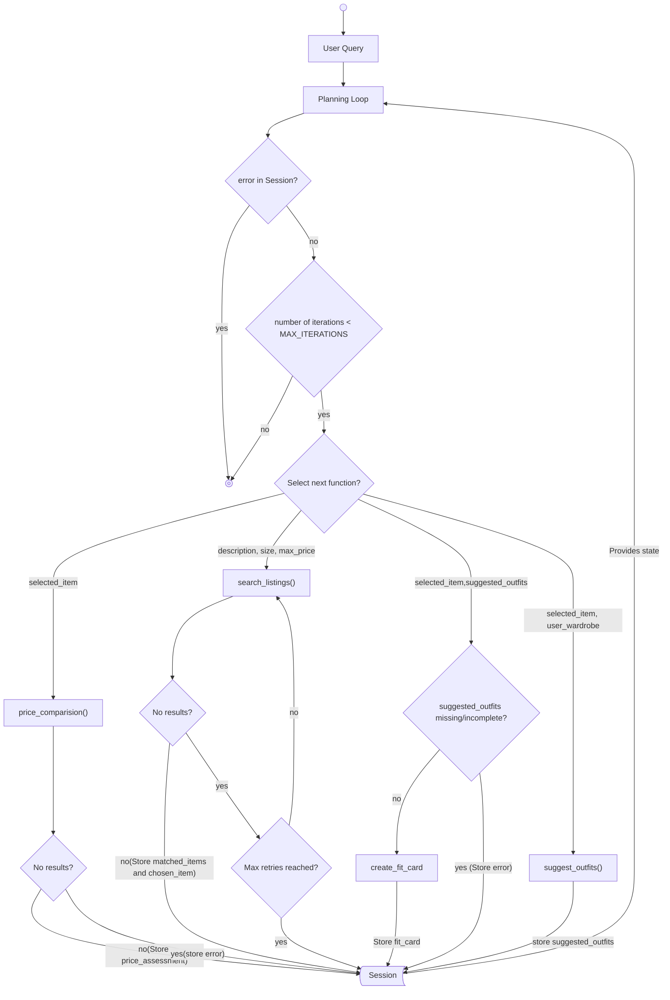

# FitFindr — planning.md

> Complete this document before writing any implementation code.
> Your spec and agent diagram are what you'll use to direct AI tools (Claude, Copilot, etc.) to generate your implementation — the more specific they are, the more useful the generated code will be.
> Your planning.md will be reviewed as part of your submission.
> Update it before starting any stretch features.

---

## Tools

List every tool your agent will use. For each tool, fill in all four fields.
You must have at least 3 tools. The three required tools are listed — add any additional tools below them.

### Tool 1: search_listings

**What it does:**
<!-- Describe what this tool does in 1–2 sentences -->
This tool searches the `listings.json` file which is a mock listings dataset based on some parameters, ranks by best match and then returns a set of matching items from the dataset.

**Input parameters:**
<!-- List each parameter, its type, and what it represents -->
- `description` (str): Describes what the item is i.e Tops, Bottoms, accessories etc.
- `size` (str): Size of the item the user wants.
- `max_price` (float): The maximum price that the user is fine to pay upto.

**What it returns:**
<!-- Describe the return value — what fields does a result contain? -->
Returns a list of matching items from the dataset. Each item is of the following format:
     "id":
    "title"
    "description"
    "category"
    "style_tags"
    "size"
    "condition"
    "price"
    "colors"
    "brand"
    "platform"

It also returns metadata indicating what parameters matched:
     description: boolean
     size: boolean
     price: boolean

**What happens if it fails or returns nothing:**
<!-- What should the agent do if no listings match? -->
The following are the ways the tool can fail:

1. No matching items are returned: Return an empty list, let the user know and then retry with size excluded, then price. If there are no results even after retry, end the workflow.
2. If either description or all parameters are not provided: Provide a descriptive error message string about what is missing.

---

### Tool 2: suggest_outfit

**What it does:**
<!-- Describe what this tool does in 1–2 sentences -->
Using the user's wardrobe and an item, this tool provides a description of what the item matches with in the user's wardrobe with details. 

**Input parameters:**
<!-- List each parameter, its type, and what it represents -->
- `new_item` (dict): Item chosen from search_listings()
- `wardrobe` (dict): List of items that the user already owns.

**What it returns:**
<!-- Describe the return value -->
A non empty string with a detailed description of what in the user's wardrobe goes with the item.

**What happens if it fails or returns nothing:**
<!-- What should the agent do if the wardrobe is empty or no outfit can be suggested? -->
1. When the wardrobe is empty or when it returns no suggestions: Provide a descriptive error message to the user and provide general styling advices with the item.

---

### Tool 3: create_fit_card

**What it does:**
<!-- Describe what this tool does in 1–2 sentences -->
This tools provides a shareable description about the new outfits generated from suggest_outfits() paired with the new item.

**Input parameters:**
<!-- List each parameter, its type, and what it represents -->
- `outfit` (string): String generated from suggest_outfits()
- `new_item`(dict): Item chosen from search_listings()

**What it returns:**
<!-- Describe the return value -->
Returns a captionable post that feels casual and authentic, capturing the outfit vibes with specific terms and also talking about the new item name, price and platform it was found on.

**What happens if it fails or returns nothing:**

1. When the outfit string is empty/incomplete or when tool returns an empty string: Provide a descriptive error message string and end the workflow.

---

### Additional Tools (if any)

### Tool 4: price_comparision

**What it does:**
<!-- Describe what this tool does in 1–2 sentences -->
This tool provides a price assessment about an item against other comparable items in the `listing.json` dataset to see if it's a fair price.

**Input parameters:**
<!-- List each parameter, its type, and what it represents -->
- `new_items` (dict): Item selected by the user.

**What it returns:**
A non empty string providing details about the price assessment and a final verdict of if the item has a fair and resonable price.
It also returns an item to the user based on the assessment.

**What happens if it fails or returns nothing:**
<!-- What should the agent do if the outfit data is incomplete? -->
1. When it returns nothing: Provide a descriptive error message string and continue the flow.

<!-- 
### Tool 5: suggest_trends -->

<!-- **What it does:**
<!-- Describe what this tool does in 1–2 sentences -->
This tool gets a list of posts/tags from a public fashion platform based on the user's sizing range if specified in the query, to find the the most trendy/popular/hot/top styles.

**Input parameters:**
<!-- List each parameter, its type, and what it represents -->
- `size` (string): User's size from the query.

**What it returns:**
<!-- Describe the return value -->
A non empty string providing details about trending and popular styles for the user's size range.

**What happens if it fails or returns nothing:**
<!--What should the agent do if the outfit data is incomplete? -->
1. When size is empty or when it returns no results: Provide a descriptive error message with respect to the issue and retry the call with no size.
 -->

---

## Planning Loop

**How does your agent decide which tool to call next?**
<!-- Describe the logic your planning loop uses. What does it look at? What conditions change its behavior? How does it know when it's done? -->
The planning loop takes the following inputs:

1. User Query
2. Session state
3. Number of iterations completed

The planning loop always checks if it's reached its maximum iterations.
1. If the number of iterations are still under the limits it continues. 
2. If this is the first iteration, it reads the query, session state and list of tools calls [search_listings, suggest_outfit, create_fit_card, price_comparision, suggest_trends], using a ReACT style prompt to reason and create a plan for which tool calls it needs to do to fulfill the query.  It then lists the tools it plans to use in order. It starts with the the first tool call and returns its responses/errors, while updating the results of each tool call in the session state. The next tool is called.
2. If the previous tool call has any errors, it will display any error messages to the user and allow the user to retry with a different query(expected results from tool calls are missing or null), answer(if required parameters are missing from the calls) or terminate the workflow gracefully if the user wants to quit.
3. If the previous tool call was successful, it will save its results to the session and then make the next tool call.
4. Once it has finished all of its tool calls or reached the iteration limits, it will provide a graceful exit message with any final responses from create_fit_card(if it's the final tool call) or any other tool called to the user.

---

## State Management

**How does information from one tool get passed to the next?**
<!-- Describe how your agent stores and accesses state within a session. What data is tracked? How is it passed between tool calls? -->
A Session variables store the user queries, wardrobe, tool call results, iterations done and allowed, tool calls made and any errors it returns. This can look like the following:

`user_queries`: dict(str)
`user_wardrobe`: dict
`matched_items`: list(dict)
`suggested_outfits`: str
`chosen_item`: dict
<!--`trends_for_user`: str-->
`price_assessment`: str
`fit_card`: str
`error`: str
`number_of_iterations`: int
`max_iterations`: 10

Once each tool call is made, it stores the results/errors it gets to the following variables:

search_listings: `matched_items`
price_comparision: `price_assessment`
suggest_outfit: `suggested_outfits`
<!--suggest_trends: `trends_for_user`-->
create_fit_card: `fit_card`

These variables are globally available to each tool call, but only the required data is passed to the tool call. The planning loop updates `number_of_iterations` iterations after each tool call. 

---

## Error Handling

For each tool, describe the specific failure mode you're handling and what the agent does in response.

| Tool | Failure mode | Agent response |
|------|-------------|----------------|
| search_listings | No results match the query | Lets the user know and retries with a looser constraint starting with size, then price(Based on Tool Spec) |
| search_listings | Description or all parameters are empty | Lets the user know what is missing and re-prompts them(Based on Tool Spec) |
| suggest_outfit | Wardrobe is empty or missing | Lets the user know and allows the tool call to happen without it(provides other general suggestions instead)(Based on Tool Spec) |
| create_fit_card | Outfit input is missing or incomplete | Lets the user know with an error message and suggests retrying their query again and gracefully exits the workflow |
| price_comparision | Returns no results | Lets the user know error message and asks user if they want to move forward(Based on Tool Spec) |
<!-- | suggest_trends | Size is missing or it returns no results  | Lets the the user know respective error message and provides general trending styles without any size(Based on Tool Spec) | -->

---

## Architecture

<!-- Draw a diagram of your agent showing how the components connect:
     User input → Planning Loop → Tools (search_listings, suggest_outfit, create_fit_card)
                                                                          ↕
                                                                   State / Session
     Show what triggers each tool, how state flows between them, and where error paths branch off.
     ASCII art, a Mermaid diagram (https://mermaid.js.org/syntax/flowchart.html), or an embedded
     sketch are all fine. You'll share this diagram with an AI tool when asking it to implement
     the planning loop and each individual tool. -->

---

## AI Tool Plan

<!-- For each part of the implementation below, describe:
     - Which AI tool you plan to use (Claude, Copilot, ChatGPT, etc.)
     - What you'll give it as input (which sections of this planning.md, your agent diagram)
     - What you expect it to produce
     - How you'll verify the output matches your spec before moving on

     "I'll use AI to help me code" is not a plan.
     "I'll give Claude my Tool 1 spec (inputs, return value, failure mode) and ask it to implement
     search_listings() using load_listings() from the data loader — then test it against 3 queries
     before trusting it" is a plan. -->

**Milestone 3 — Individual tool implementations:**
I will use Claude Code, Claude and ChatGPT and provide the Tool specs for the 5 tools in planning.md to generate code, test cases using pytest through test driven development and run these test cases to make sure it works as mentioned in the Spec documents.

**Milestone 4 — Planning loop and state management:**
I will use Claude Code, Claude and ChatGPT and provide the Planning Loop, State Management and the Agent diagram in planning.md to generate the Agent code and setup a test agent to make sure it is working as mentioned in the specs.

---

## A Complete Interaction (Step by Step)

Write out what a full user interaction looks like from start to finish — tool call by tool call. Use a specific example query.

**Example user query:** "I am looking for a reasonably priced, cute midi summer dress. I am a size M and my budget is upto 100. I am looking for some top and trendy outfits. "

**Step 1:**
<!-- What does the agent do first? Which tool is called? With what input? -->
The agent plans what it needs to do. The query mentions choosing a summer dress with the description, size, price mentioned. 
The agent first loads the user's wardrobe details during setup based on the wardrobe_choice from `wardrobe_schema.json`. Then it creates a plan on how to search for a dress with the given details, deciding to call search_listings, price_comparision, suggest_outfits and create_fit_card in the respective order. It creates any tool parameters from the query or passes in the required session_variables needed.

**Step 2:**
<!-- What happens next? What was returned from step 1? What tool is called now? -->
The agent parses the query to get `description`, `size` and `max_price` which is passed to the search_listings tool.This returns a list of matching dresses ans stores it in `matched_items`. The agent shows the results and then picks the top matched dress. If the results are missing or empty, the agent will retry the tool call again, dropping size first, updating the user. If the results are still empty, then price is dropped and again the user is updated. If no results come again, the agent prompts the user to try again with different suggestions and gracefully ends the worflow with no outputs for suggest_outfits and create_fit_card(Refer to **Final output to user**)

**Step 3:**
If Step 2 has any results, then the top item is stored in `selected_item` and passed to the price_comparision tool to check if the price of the dress chosen is reasonable as asked by the user in the query. Based on the assessment, the agent prompts the user on if they want to follow through the rest of the steps or exit the workflow gracefully asking it to try with a different suggestion.

<!-- **Step 4:**
If the result of Step 3 is the user stopping or retrying, then the whole workflow gets reset(Refer **Final Output to the user**).

If the user agrees to move forward, then the user's size is passed to the suggest_trends tool to provide top trending styles and returns a response string since they are looking for trendy outfits. -->

**Step 4:**
`user_wardrobe` along with `selected_item` from Step 2 is passed to the suggest_outfits tool to list what pairs well with the dress and provides detailed outfit suggestions and returns a response string. If `user_wardrobe` is empty, the tool call continues but the result provided will be more general. This is stored to `suggested_outfits`.

<!-- **Step 5:**

The agent combines the response from Step 4 and Step 5 to give a more upto date suggestion. If there is no Step 4 call involved, it simply passes the output of Step 5 to the next step. -->

**Step 5:**
`suggested_outfits` and `selected_item` from Step 2 is passed to the create_fit_card tool, which is the final tool call to provide a catchy post-worthy description to the user. This is stored in `fit_card` and then the workflow loop ends.

**Final output to user:**
<!-- What does the user actually see at the end? -->
The final output provides the user with details from the following three calls in a summary fashion which is readable:
search_listings, suggest_outfits and create_fit_card.
If any of the tool calls returns an error, then store it in the `error` variable identifying the function that failed.
Note that create_fit_card is the final tool called if all previous steps are successful.

